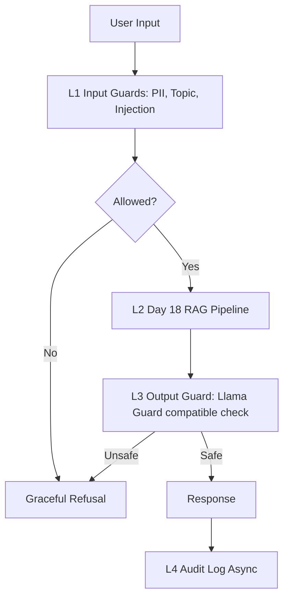

# Production RAG Evaluation and Guardrail Blueprint

## SLOs
| Metric | Target | Alert Threshold | Severity |
|---|---|---|---|
| Faithfulness | >=0.85 | <0.80 for 30 min | P2 |
| Answer Relevancy | >=0.80 | <0.75 for 30 min | P2 |
| Context Precision | >=0.70 | <0.65 for 1h | P3 |
| Context Recall | >=0.75 | <0.70 for 1h | P3 |
| P95 Latency with guardrails | <2.5s | >3s for 5 min | P1 |
| Guardrail Detection Rate | >=90% | <85% | P2 |
| False Positive Rate | <5% | >10% | P2 |

## Architecture

## Alert Playbook
### Incident: Faithfulness drops below 0.80
**Severity:** P2
**Detection:** Continuous RAGAS eval alert.
**Likely causes:** bad retrieval, prompt drift, stale index.
**Investigation:** compare CP/CR, check prompt diff, inspect document update log.
**Resolution:** re-index, tune retriever, or rollback prompt.

### Incident: P95 latency above 3s
**Severity:** P1
**Detection:** latency dashboard.
**Likely causes:** slow LLM, output guard API delay, overloaded vector DB.
**Investigation:** split L1/L2/L3 timings and inspect provider status.
**Resolution:** cache safe checks, reduce top_k, switch fallback model.

### Incident: Guardrail detection rate below 85%
**Severity:** P2
**Detection:** adversarial regression suite.
**Likely causes:** new jailbreak pattern or weak topic rules.
**Investigation:** cluster missed attacks by type.
**Resolution:** add attack signatures and re-run calibration.

## Monthly Cost Estimate
| Component | Unit Cost | Volume | Monthly Cost |
|---|---:|---:|---:|
| RAG generation GPT-4o-mini | $0.001/query | 100k | $100 |
| RAGAS eval 1% sample | $0.01/query | 1k | $10 |
| LLM judge tier 2 | $0.001/query | 10k | $10 |
| High-stakes judge tier | $0.05/query | 1k | $50 |
| Presidio/self-hosted regex | $0 | 100k | $0 |
| Llama Guard compatible API/self-host | $0.30/hr | 720h | $216 |
| **Total** | | | **$386** |

Cost optimization: sample eval traffic, tier judge models by risk, cache repeated guardrail decisions, and use self-hosted guards only when volume justifies GPU cost.
